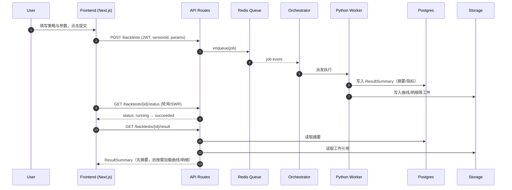
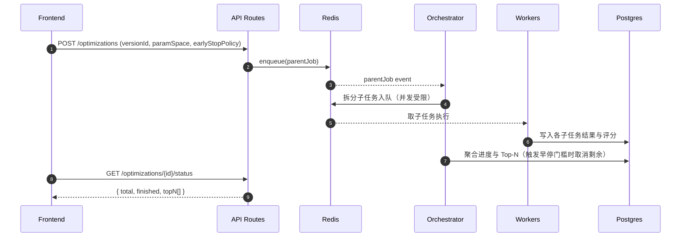
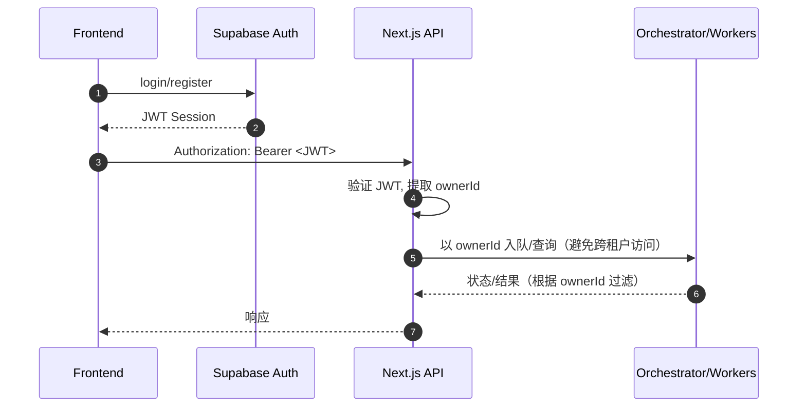
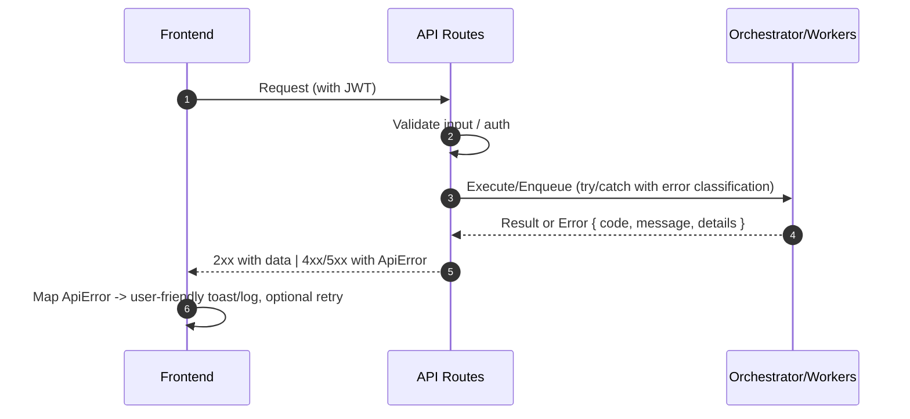

---
# A 股量化策略回测终端（SaaS） Fullstack Architecture Document

版本：v0.1
日期：2025-09-10 (UTC+8)
作者：Winston（Architect）
关联：`docs/prd.md`, `docs/front-end-spec.md`
分片目录：参见 [Architecture Document Index](./architecture/README.md)

## Introduction

本文件将为「A 股量化策略回测终端（SaaS）」提供统一的全栈架构蓝图，覆盖前端实现、后端系统与二者的集成方式，作为 AI 驱动的开发单一真实来源（Single Source of Truth）。我们将以 Monorepo 的代码组织为基础，前端采用 Next.js（App Router + TypeScript），后端以 Next.js API Routes（MVP 阶段）承载轻 API 层，并独立出 Python 回测/寻优服务与 Redis 队列，实现「编辑 → 回测 → 结果」的最短路径。该架构强调作业编排、数据频控、结果模型统一与高性能可视化，以满足 PRD 中关于首屏性能、队列时延、可观测性、成本效率与可扩展性的非功能需求（NFR）。

### Starter Template or Existing Project

- N/A - Greenfield project  
  PRD 未指明使用现有 Starter 或既有代码库。考虑到 Next.js + Supabase + Python 回测服务 + Redis 的组合常见于 Vercel/Supabase 快速迭代生态，我们后续将在「平台与基础设施选择」中给出 Vercel + Supabase 与自托管（或云厂商）备选路径，并在统一项目结构（Monorepo）与包边界上留出演进弹性。

### Change Log

| Date       | Version | Description                        | Author    |
| ---------- | ------- | ---------------------------------- | --------- |
| 2025-09-10 | v0.1    | 初稿：引言、项目基线与变更记录创建 | Architect |

---

## High Level Architecture

### Technical Summary

- 采用「Monolith + 独立计算服务」：前端与轻 API 层由 Next.js（App Router + TypeScript）承载；回测/寻优由独立 Python 服务与 Redis 队列负责。此形态在 MVP 阶段可显著降低复杂度，同时确保关键 FR（作业提交/状态/结果）与 NFR（队列时延、首屏性能）的达成。
- 前端通过 Supabase Auth 完成登录/注册与会话管理。Next.js API Routes 暂时代替独立 API 网关；为后续演进保留迁移路径（API Gateway/BFF）。
- 数据与文件存储优先使用 Supabase Postgres/Storage；回测结果的大文件通过对象存储管理；历史记录与作业状态统一建模以支持复运行与导出。
- 队列使用 Redis（RQ 或 Celery 二选一，默认 RQ 作为 MVP 选项），支持重试、超时与早停；结合结构化日志与指标埋点满足可观测性需求。
- 外部数据源 Tushare 通过中间层频控与缓存；在结果页采用“摘要先行（2s 首屏）→ 曲线 → 明细”的渐进式加载策略达成体验目标。
- 平台上建议 Vercel + Supabase 快速起步，可按需演进为混合部署（自托管 Python/Redis）。

### Platform and Infrastructure Choice（结论）

- 推荐：Vercel + Supabase（MVP），可演进为混合（自托管 Python/Redis 同区或近区）。
- 区域：Vercel Global Edge + Supabase AP-Southeast-1（建议）。
- 服务：Next.js Hosting、Supabase Auth/Postgres/Storage、Redis、Python Workers。

### Repository Structure（建议）

- Monorepo（Turborepo 或 npm workspaces + turbo）。
- apps/web、apps/api（可与 web 合并为 Next.js routes）、services/backtest（Python）、services/workers（Python）、packages/shared、infra。

### High Level Architecture Diagram

```mermaid
graph TD
  U[User (Browser)] --> FE[Next.js App (Vercel)]
  FE -->|Auth| SUPA_AUTH[Supabase Auth]
  FE -->|API Calls| API[Next.js API Routes (Vercel)]
  API --> DB[(Supabase Postgres)]
  API --> STORE[(Supabase Storage)]
  API --> QUEUE[(Redis)]
  API -->|Submit Jobs| ENQ[(Enqueue Job)]
  QUEUE --> WRK[Python Workers (Backtest/Opt)]
  WRK --> DS[Tushare Data Layer]
  WRK --> RES[(Result Artifacts/Object Storage)]
  WRK --> DB
  FE -->|Results (summary->chart->details)| API
  subgraph External
    DS[Tushare API]
  end
  subgraph Compute
    QUEUE
    WRK
  end
```

### Architectural Patterns

- Jamstack/Serverless Monolith + Independent Compute（MVP 简化复杂度，计算/队列独立）
- Component-Based UI + Typed Service Layer（`packages/shared` 统一类型与契约）
- Repository Pattern（后端数据访问抽象）
- BFF（演进方向，必要时引入 API Gateway）
- Structured Logging + Observability Baseline（覆盖作业/队列/数据层指标与告警）

## Tech Stack

以下为基于当前已确认的平台方案（Vercel + Supabase，计算与队列可演进为自托管 Python/Redis）的技术栈初稿。该表为“单一真实来源”，后续开发需遵循此表的版本与约束；如需调整，将在此处更新。

### Technology Stack Table

| Category             | Technology                                 | Version                    | Purpose                       | Rationale                                            |
| -------------------- | ------------------------------------------ | -------------------------- | ----------------------------- | ---------------------------------------------------- |
| Frontend Language    | TypeScript                                 | 5.x                        | 类型安全、契约共享            | 与 Next.js 生态契合，配合 `packages/shared` 统一类型 |
| Frontend Framework   | Next.js (App Router)                       | 14/15 LTS                  | 前端与轻 API 层               | 与 Vercel 原生集成，SSR/ISR/Edge 能力完善            |
| UI Component Library | Tailwind CSS + Headless UI                 | 3.x / 最新                 | 快速构建、可定制              | 金融数据密度高，原子化样式与可达性组件配套           |
| State Management     | Zustand（或 Redux Toolkit）                | 最新                       | 轻量状态与页面间共享          | MVP 优先简单；如需复杂中间件可切换 RTK               |
| Backend Language     | TypeScript + Python                        | TS 5.x / Py 3.11+          | API 层（TS）与回测/寻优（Py） | 契约统一 + 计算灵活                                  |
| Backend Framework    | Next.js API Routes（MVP） + Python FastAPI | Next 14/15 + FastAPI 0.11x | 轻 API 与计算服务接口         | 降低门槛，后续可迁移至 BFF/API Gateway               |
| API Style            | REST                                       | OpenAPI 3                  | 简洁稳定的契约                | 贴合 PRD MVP，“submit/status/result/opt-grid” 明确   |
| Database             | Supabase Postgres                          | 15.x                       | 业务数据、作业/历史           | 托管省运维；与 Auth/Storage 协同                     |
| Cache                | Redis                                      | 7.x                        | 队列、速率限制、部分缓存      | 满足 NFR1 队列时延；支持早停/重试                    |
| File Storage         | Supabase Storage（+ 对象存储可选）         | 最新                       | 结果大文件、导出              | 成本与迭代效率平衡，必要时接对象存储                 |
| Authentication       | Supabase Auth                              | 最新                       | 登录/注册、会话               | 直接与前端集成、可扩展权限                           |
| Frontend Testing     | Vitest + React Testing Library             | 最新                       | 组件与逻辑单测                | 轻量、速度快，贴合 Vite/Next 开发体验                |
| Backend Testing      | Jest（API TS）+ Pytest（Python 服务）      | 最新                       | API/服务层单测                | 双栈分别用主流测试框架                               |
| E2E Testing          | Playwright                                 | 最新                       | 登录 → 提交 → 结果首屏路径    | 覆盖关键闭环与性能断言                               |
| Build Tool           | Turborepo                                  | 最新                       | Monorepo 构建/任务编排        | 多包协同、缓存加速                                   |
| Bundler              | Next.js 默认（Turbopack/Webpack）          | 随 Next                    | 前端打包                      | 使用官方默认，减少自定义成本                         |
| IaC Tool             | Terraform（后续引入）                      | 1.6+                       | 基础设施声明式管理            | MVP 后期逐步落地，支持混合/自托管演进                |
| CI/CD                | GitHub Actions                             | 最新                       | 构建、测试、部署              | 生态成熟，适配 Vercel/Supabase/自托管                |
| Monitoring           | OpenTelemetry + Sentry                     | 最新                       | 追踪/错误上报                 | 统一链路追踪与错误聚合                               |
| Logging              | Pino（TS）+ structlog（Py）                | 最新                       | 结构化日志                    | 满足可观测性与问题定位                               |
| CSS Framework        | Tailwind CSS                               | 3.x                        | 样式与主题                    | 快速一致、暗色模式友好                               |

简要说明

- 前端：Next.js + TS + Tailwind，以“摘要先行 → 曲线 → 明细”的加载策略实现 NFR2 首屏 2s 目标。图表建议 ECharts 5（对金融类图表交互友好，数据量支持好）。
- 后端 API：MVP 用 Next.js API routes；回测/寻优提供 FastAPI 服务以获得更佳的 Python 生态与性能；二者以 REST 契约对齐 `packages/shared` 的类型与接口描述。
- 队列：Redis 7；默认 RQ（上手快），若后续需要复杂编排或分布式任务路由，可无缝切换 Celery（保留观察点）。
- 监控与日志：统一结构化日志，关键作业指标（提交/等待/执行/P95/P99）透传至 OTel，并通过 Sentry 做错误聚合与告警。
- CI/CD：GitHub Actions 对接 Vercel 部署前端与 API，Python 服务与 Redis 可走自托管或托管方案的独立流水线。

## Data Models

基于 PRD 的 FR/NFR 与 Epics，定义 MVP 的核心概念模型并给出共享 TS 接口（用于 `packages/shared/types/`）。数据库落地将在后续“Database Schema”章节实现。

### 核心模型列表

- Strategy（策略）
- StrategyVersion（策略版本）
- BacktestJob（回测作业）
- OptimizationJob（寻优父作业）
- OptimizationTask（寻优子作业）
- ResultSummary（结果摘要）
- Trade（交易明细）
- QuotaUsage（配额/软计费）
- HealthStatus（健康/可用性）

### Strategy

Purpose：策略元数据/标签，与提交回测联动。

```ts
export interface Strategy {
  id: string;
  ownerId: string;
  name: string;
  tags: string[];
  createdAt: string; // ISO
  updatedAt: string; // ISO
  latestVersionId?: string;
}
```

### StrategyVersion

Purpose：固化代码与依赖的时间戳版本。

```ts
export interface StrategyVersion {
  id: string;
  strategyId: string;
  code: string; // or storage ref
  requirements: string[];
  metadata?: Record<string, any>;
  createdAt: string;
}
```

### BacktestJob

Purpose：单次回测作业，统一状态机与错误对象。

```ts
export interface BacktestJob {
  id: string;
  ownerId: string;
  versionId: string;
  params: Record<string, any>;
  status:
    | "queued"
    | "running"
    | "succeeded"
    | "failed"
    | "early-stopped"
    | "canceled";
  progress?: number; // 0..1
  retries: number;
  error?: { code: string; message: string };
  resultSummaryId?: string;
  createdAt: string;
  updatedAt: string;
}
```

### OptimizationJob（父）

Purpose：参数空间寻优的聚合与编排实体。

```ts
export interface OptimizationJob {
  id: string;
  ownerId: string;
  versionId: string;
  paramSpace: Record<string, any>;
  concurrencyLimit: number;
  earlyStopPolicy?: { metric: string; threshold: number; mode: "min" | "max" };
  status: BacktestJob["status"];
  summary?: {
    total: number;
    finished: number;
    topN: Array<{ taskId: string; score: number }>;
  };
  createdAt: string;
  updatedAt: string;
}
```

### OptimizationTask（子）

Purpose：具体参数组合的回测任务，与 BacktestJob 接近。

```ts
export interface OptimizationTask {
  id: string;
  jobId: string; // parent
  ownerId: string;
  versionId: string;
  params: Record<string, any>;
  status: BacktestJob["status"];
  progress?: number;
  retries: number;
  error?: { code: string; message: string };
  resultSummaryId?: string;
  score?: number; // e.g., sharpe
  createdAt: string;
  updatedAt: string;
}
```

### ResultSummary

Purpose：支撑“2 秒首屏”的摘要，曲线/明细走延迟加载或外部存储引用。

```ts
export interface ResultSummary {
  id: string;
  ownerId: string;
  metrics: { [k: string]: number | undefined }; // sharpe/return/mdd...
  equityCurveRef?: string; // storage/table ref
  tradesRef?: string; // storage/table ref
  artifacts?: Array<{ type: string; url: string }>;
  createdAt: string;
}
```

### Trade

Purpose：交易明细，支持筛选/导出/大数据分页。

```ts
export interface Trade {
  id: string;
  resultId: string;
  ts: string;
  symbol: string;
  side: "buy" | "sell";
  qty: number;
  price: number;
  fee?: number;
  pnl?: number;
  meta?: Record<string, any>;
}
```

### QuotaUsage（软计费）

Purpose：记录使用量并与 Free/Pro 配额展示联动。

```ts
export interface QuotaUsage {
  id: string;
  ownerId: string;
  scope: "backtest" | "optimize" | "storage" | "api";
  amount: number;
  period: "day" | "month";
  updatedAt: string;
}
```

### HealthStatus

Purpose：健康/可用性快照。

```ts
export interface HealthStatus {
  service: "api" | "worker" | "queue" | "datasource";
  status: "up" | "degraded" | "down";
  details?: Record<string, any>;
  ts: string;
}
```

关系概览：

- Strategy 1—N StrategyVersion
- StrategyVersion 1—N BacktestJob，1—N OptimizationTask
- OptimizationJob 1—N OptimizationTask
- BacktestJob/OptimizationTask 1—1 ResultSummary；ResultSummary 1—N Trade（或经 Ref 指向外部存储）

## API Specification（REST, OpenAPI 3 骨架）

说明

- 认证：采用 Supabase Auth（JWT）携带于 `Authorization: Bearer <token>`；服务端据此解析 `ownerId`。
- 版本：`/api/v1` 作为前缀；错误返回统一 `ApiError` 结构。
- 契约来源：与 `packages/shared/types/` 中的 TS 接口对齐；Python 侧以 pydantic schema 映射。

````yaml
openapi: 3.0.0
info:
  title: StockStock Fullstack API
  version: 0.1.0
  description: MVP endpoints for backtest and optimization workflows
servers:
  - url: https://{host}/api/v1
    variables:
      host:
        default: example.com

paths:
  /backtests:
    post:
      summary: Submit a backtest job
      security: [{ bearerAuth: [] }]
      requestBody:
        required: true
        content:
          application/json:
            schema:
              $ref: '#/components/schemas/BacktestSubmitRequest'
      responses:
        '202':
          description: Accepted
          content:
            application/json:
              schema:
                $ref: '#/components/schemas/BacktestSubmitResponse'

  /backtests/{id}/status:
    get:
      summary: Get backtest job status
      security: [{ bearerAuth: [] }]
      parameters:
        - in: path
          name: id
          required: true
          schema: { type: string }
      responses:
        '200':
          description: OK
          content:
            application/json:
              schema:
                $ref: '#/components/schemas/BacktestStatusResponse'

  /backtests/{id}/result:
    get:
      summary: Get backtest result summary
      security: [{ bearerAuth: [] }]
      parameters:
        - in: path
          name: id
          required: true
          schema: { type: string }
      responses:
        '200':
          description: OK
          content:
            application/json:
              schema:
                $ref: '#/components/schemas/ResultSummary'

  /backtests/{id}/cancel:
    post:
      summary: Cancel a running backtest job
      security: [{ bearerAuth: [] }]
      parameters:
        - in: path
          name: id
          required: true
          schema: { type: string }
      responses:
        '202': { description: Accepted }

  /optimizations:
    post:
      summary: Submit an optimization (grid search) job
      security: [{ bearerAuth: [] }]
      requestBody:
        required: true
        content:
          application/json:
            schema:
              $ref: '#/components/schemas/OptimizationSubmitRequest'
      responses:
        '202':
          description: Accepted
          content:
            application/json:
              schema:
                $ref: '#/components/schemas/OptimizationSubmitResponse'

  /optimizations/{id}/status:
    get:
      summary: Get optimization parent job status and aggregation
      security: [{ bearerAuth: [] }]
      parameters:
        - in: path
          name: id
          required: true
          schema: { type: string }
      responses:
        '200':
          description: OK
          content:
            application/json:
              schema:
                $ref: '#/components/schemas/OptimizationStatusResponse'

  /health:
    get:
      summary: Health/Canary endpoint
      responses:
        '200':
          description: OK
          content:
            application/json:
              schema:
                $ref: '#/components/schemas/HealthStatus'

components:
  securitySchemes:
    bearerAuth:
      type: http
      scheme: bearer
      bearerFormat: JWT

  schemas:
    ApiError:
      type: object
      properties:
        error:
          type: object
          properties:
            code: { type: string }
            message: { type: string }
            details: { type: object, additionalProperties: true }
            timestamp: { type: string }
            requestId: { type: string }

    BacktestSubmitRequest:
      type: object
      required: [versionId, params]
      properties:
        versionId: { type: string }
        params:
          type: object
          additionalProperties: true
    BacktestSubmitResponse:
      type: object
      properties:
        id: { type: string }
        status: { $ref: '#/components/schemas/JobStatus' }

    BacktestStatusResponse:
      type: object
      properties:
        id: { type: string }
        status: { $ref: '#/components/schemas/JobStatus' }
        progress: { type: number }
        retries: { type: integer }
        error: { $ref: '#/components/schemas/ApiError' }
        resultSummaryId: { type: string }

    OptimizationSubmitRequest:
      type: object
      required: [versionId, paramSpace]
      properties:
        versionId: { type: string }
        concurrencyLimit: { type: integer, default: 2 }
        earlyStopPolicy:
          type: object
          properties:
            metric: { type: string }
            threshold: { type: number }
            mode: { type: string, enum: [min, max] }
        paramSpace:
          type: object
          additionalProperties: true
    OptimizationSubmitResponse:
      type: object
      properties:
        id: { type: string }
        status: { $ref: '#/components/schemas/JobStatus' }

    OptimizationStatusResponse:
      type: object
      properties:
        id: { type: string }
        status: { $ref: '#/components/schemas/JobStatus' }
 - 契约来源：与 `packages/shared/types/` 中的 TS 接口对齐；Python 侧以 pydantic schema 映射。

 ```yaml
 openapi: 3.0.0
 info:
   title: StockStock Fullstack API
   version: 0.1.0
   description: MVP endpoints for backtest and optimization workflows
 servers:
   - url: https://{host}/api/v1
     variables:
       host:
         default: example.com

 paths:
   /backtests:
     post:
       summary: Submit a backtest job
       security: [{ bearerAuth: [] }]
       requestBody:
         required: true
         content:
           application/json:
             schema:
               $ref: '#/components/schemas/BacktestSubmitRequest'
       responses:
         '202':
           description: Accepted
           content:
             application/json:
               schema:
                 $ref: '#/components/schemas/BacktestSubmitResponse'

   /backtests/{id}/status:
     get:
       summary: Get backtest job status
       security: [{ bearerAuth: [] }]
       parameters:
         - in: path
           name: id
           required: true
           schema: { type: string }
       responses:
         '200':
           description: OK
           content:
             application/json:
               schema:
                 $ref: '#/components/schemas/BacktestStatusResponse'

   /backtests/{id}/result:
     get:
       summary: Get backtest result summary
       security: [{ bearerAuth: [] }]
       parameters:
         - in: path
           name: id
           required: true
           schema: { type: string }
       responses:
         '200':
           description: OK
           content:
             application/json:
               schema:
                 $ref: '#/components/schemas/ResultSummary'

   /backtests/{id}/cancel:
     post:
       summary: Cancel a running backtest job
       security: [{ bearerAuth: [] }]
       parameters:
         - in: path
           name: id
           required: true
           schema: { type: string }
       responses:
         '202': { description: Accepted }

   /optimizations:
     post:
       summary: Submit an optimization (grid search) job
       security: [{ bearerAuth: [] }]
       requestBody:
         required: true
         content:
           application/json:
             schema:
               $ref: '#/components/schemas/OptimizationSubmitRequest'
       responses:
         '202':
           description: Accepted
           content:
             application/json:
               schema:
                 $ref: '#/components/schemas/OptimizationSubmitResponse'

   /optimizations/{id}/status:
     get:
       summary: Get optimization parent job status and aggregation
       security: [{ bearerAuth: [] }]
       parameters:
         - in: path
           name: id
           required: true
           schema: { type: string }
       responses:
         '200':
           description: OK
           content:
             application/json:
               schema:
                 $ref: '#/components/schemas/OptimizationStatusResponse'

   /health:
     get:
       summary: Health/Canary endpoint
       responses:
         '200':
           description: OK
           content:
             application/json:
               schema:
                 $ref: '#/components/schemas/HealthStatus'

 components:
   securitySchemes:
     bearerAuth:
       type: http
       scheme: bearer
       bearerFormat: JWT

   schemas:
     ApiError:
       type: object
       properties:
         error:
           type: object
           properties:
             code: { type: string }
             message: { type: string }
             details: { type: object, additionalProperties: true }
             timestamp: { type: string }
             requestId: { type: string }

     BacktestSubmitRequest:
       type: object
       required: [versionId, params]
       properties:
         versionId: { type: string }
         params:
           type: object
           additionalProperties: true
     BacktestSubmitResponse:
       type: object
       properties:
         id: { type: string }
         status: { $ref: '#/components/schemas/JobStatus' }

     BacktestStatusResponse:
       type: object
       properties:
         id: { type: string }
         status: { $ref: '#/components/schemas/JobStatus' }
         progress: { type: number }
         retries: { type: integer }
         error: { $ref: '#/components/schemas/ApiError' }
         resultSummaryId: { type: string }

     OptimizationSubmitRequest:
       type: object
       required: [versionId, paramSpace]
       properties:
         versionId: { type: string }
         concurrencyLimit: { type: integer, default: 2 }
         earlyStopPolicy:
           type: object
           properties:
             metric: { type: string }
             threshold: { type: number }
             mode: { type: string, enum: [min, max] }
         paramSpace:
           type: object
           additionalProperties: true
     OptimizationSubmitResponse:
       type: object
       properties:
         id: { type: string }
         status: { $ref: '#/components/schemas/JobStatus' }

     OptimizationStatusResponse:
       type: object
       properties:
         id: { type: string }
         status: { $ref: '#/components/schemas/JobStatus' }
         summary:
           type: object
           properties:
             total: { type: integer }
             finished: { type: integer }
             topN:
               type: array
               items:
                 type: object
                 properties:
                   taskId: { type: string }
                   score: { type: number }

     JobStatus:
       type: string
       enum: [queued, running, succeeded, failed, early-stopped, canceled]

     ResultSummary:
       type: object
       properties:
         id: { type: string }
         ownerId: { type: string }
         metrics:
           type: object
           additionalProperties: { type: number }
         equityCurveRef: { type: string }
         tradesRef: { type: string }
         artifacts:
           type: array
           items:
             type: object
             properties:
               type: { type: string }
               url: { type: string }
         createdAt: { type: string }

     HealthStatus:
       type: object
       properties:
         service: { type: string, enum: [api, worker, queue, datasource] }
         status: { type: string, enum: [up, degraded, down] }
         details: { type: object, additionalProperties: true }
         ts: { type: string }

---
## Components Diagrams

下面给出容器级与组件级关系图，辅助理解模块边界与依赖。

```mermaid
flowchart TB
  subgraph Client
    FE[Frontend App (Next.js)]
  end

  subgraph API[API Layer (Next.js API Routes)]
    APIRoutes[[REST Endpoints]]
    Repo[Data Access (Repositories)]
  end

  subgraph Compute[Compute & Queue]
    Redis[(Redis Queue/Cache)]
    Orchestrator[Orchestrator]
    Workers[Python Workers (Backtest/Opt)]
  end

  subgraph Data[Data & Storage]
    DB[(Supabase Postgres)]
    Store[(Supabase Storage / Object Storage)]
  end

  DS[Tushare API]

  FE -->|Auth/JWT| APIRoutes
  FE -->|REST| APIRoutes
  APIRoutes --> Repo
  APIRoutes --> Redis
  Repo --> DB
  Orchestrator --> Redis
  Redis --> Workers
  Workers --> DS
  Workers --> Store
  Workers --> DB
  FE -->|fetch summary/curve/trades| APIRoutes
````

Rationale

- 前端只与 REST 接口交互；API 层保持薄，复杂度集中在编排与 Worker。
- 结果摘要/大文件分离，通过 Postgres 与对象存储分别管理，满足 NFR2。

```mermaid
flowchart LR
  FE[Frontend Service Layer] -->|submitBacktest| APIRoutes
  APIRoutes -->|enqueue| Redis
  Redis --> Orchestrator
  Orchestrator -->|spawn tasks| Workers
  Workers -->|write summary| DB
  Workers -->|write artifacts| Store
  FE -->|getStatus/getResult| APIRoutes
  APIRoutes --> DB
  APIRoutes --> Store
```

---

## Core Workflows（Sequence）

### 提交流程：Backtest Submit → Status → Result



### 寻优流程：Optimization Submit（含早停/Top‑N 聚合）



Rationale

- 父子作业拆分保证可控并发与聚合能力；Top‑N 与早停加速资源利用。
- 所有错误通过标准错误码/消息上送，便于用户提示与运维监控。

---

## Frontend Architecture

本节定义前端的组件组织、模板规范、状态管理、路由结构与服务层，确保与 `packages/shared` 的类型契约一致，并满足“摘要先行 → 曲线 → 明细”的性能策略。

### Component Architecture

#### Component Organization

```text
apps/web/
  src/
    app/                      # Next.js App Router 根
      (auth)/                 # 认证相关段
      (dashboard)/            # 登录后核心应用
        backtests/
          page.tsx           # 列表/提交入口
          [id]/
            page.tsx         # 结果详情（摘要→曲线→明细）
        optimizations/
          page.tsx
          [id]/
            page.tsx
        settings/
          quotas/page.tsx
      layout.tsx
      page.tsx                # 登录/欢迎页
      api/                    # （可选）仅限轻 API 代理/边缘逻辑
    components/
      charts/                 # ECharts 组件（懒加载）
      forms/                  # 提交/参数表单
      layout/                 # 布局与导航
      feedback/               # Toast/Empty/Error 等
    services/                 # 前端服务层（API Client 封装）
    stores/                   # Zustand/Query 等状态
    utils/                    # 工具/格式化/guard
    styles/
```

#### Component Template（示例）

```tsx
// apps/web/src/components/charts/EquityCurve.tsx
import React from "react";
import dynamic from "next/dynamic";

const ECharts = dynamic(() => import("echarts-for-react"), { ssr: false });

type Props = {
  series: Array<{ time: string; value: number }>;
  height?: number;
};

export function EquityCurve({ series, height = 300 }: Props) {
  const option = {
    tooltip: { trigger: "axis" },
    xAxis: { type: "category", data: series.map((s) => s.time) },
    yAxis: { type: "value" },
    series: [{ type: "line", data: series.map((s) => s.value), smooth: true }],
  };
  return <ECharts option={option} style={{ height }} />;
}
```

### State Management Architecture

#### State Structure（Zustand + SWR/TanStack Query 可选）

```ts
// apps/web/src/stores/useJobsStore.ts
import { create } from "zustand";

type JobStatus =
  | "queued"
  | "running"
  | "succeeded"
  | "failed"
  | "early-stopped"
  | "canceled";

type Job = { id: string; status: JobStatus; progress?: number };

type JobsState = {
  items: Record<string, Job>;
  upsert: (job: Job) => void;
};

export const useJobsStore = create<JobsState>((set) => ({
  items: {},
  upsert: (job) => set((s) => ({ items: { ...s.items, [job.id]: job } })),
}));
```

#### State Patterns

- 使用 `stores/` 维护轻量全局态（作业状态/用户态）。
- 数据获取优先使用服务层 + SWR/TanStack Query（含缓存/重试/失效策略）。
- 结果页采用分步加载：先 `GET /backtests/{id}/status` 与摘要，再按需拉取曲线/明细。

### Routing Architecture

#### Route Organization（App Router）

```text
app/
  page.tsx                 # 登录/欢迎
  (dashboard)/
    layout.tsx
    backtests/page.tsx
    backtests/[id]/page.tsx
    optimizations/page.tsx
    optimizations/[id]/page.tsx
    settings/quotas/page.tsx
```

#### Protected Route Pattern（Supabase Auth）

```tsx
// apps/web/src/app/(dashboard)/layout.tsx
import { redirect } from "next/navigation";
import { getSupabaseServerClient } from "@/services/supabaseServer";

export default async function DashboardLayout({
  children,
}: {
  children: React.ReactNode;
}) {
  const supabase = getSupabaseServerClient();
  const {
    data: { user },
  } = await supabase.auth.getUser();
  if (!user) redirect("/login");
  return <>{children}</>;
}
```

### Frontend Services Layer

#### API Client Setup

```ts
// apps/web/src/services/apiClient.ts
export const API_BASE = process.env.NEXT_PUBLIC_API_BASE ?? "/api/v1";

async function http<T>(path: string, init?: RequestInit): Promise<T> {
  const res = await fetch(`${API_BASE}${path}`, {
    ...init,
    headers: { "Content-Type": "application/json", ...(init?.headers || {}) },
    cache: "no-store",
  });
  if (!res.ok) {
    const err = await res.json().catch(() => ({}));
    throw new Error(err?.error?.message || `HTTP ${res.status}`);
  }
  return res.json() as Promise<T>;
}

export const api = {
  get: <T>(path: string) => http<T>(path, { method: "GET" }),
  post: <T>(path: string, body?: unknown) =>
    http<T>(path, { method: "POST", body: JSON.stringify(body) }),
};
```

#### Service Example

```ts
// apps/web/src/services/backtests.ts
import { api } from "./apiClient";

export type BacktestSubmitRequest = {
  versionId: string;
  params: Record<string, any>;
};
export type BacktestSubmitResponse = { id: string; status: string };
export type BacktestStatusResponse = {
  id: string;
  status: string;
  progress?: number;
};
export type ResultSummary = {
  id: string;
  metrics: Record<string, number>;
  equityCurveRef?: string;
};

export const submitBacktest = (payload: BacktestSubmitRequest) =>
  api.post<BacktestSubmitResponse>(`/backtests`, payload);

export const getBacktestStatus = (id: string) =>
  api.get<BacktestStatusResponse>(`/backtests/${id}/status`);

export const getBacktestResult = (id: string) =>
  api.get<ResultSummary>(`/backtests/${id}/result`);
```

Rationale

- 组件按领域组织，图表懒加载，减少首屏体积。
- Auth 在布局层保护路由，避免页面内部重复校验。
- 服务层封装 HTTP/错误，统一与 `packages/shared` 类型，便于替换底层实现（如切换到 BFF）。

---

## Backend Architecture

本节定义后端的服务组织、数据库架构与鉴权实现细节。MVP 阶段采用「Next.js API Routes（Serverless/Edge 友好）+ Python FastAPI（传统服务）+ Redis 队列」的混合形态，并为后续演进到 BFF/API Gateway 预留空间。

### Service Architecture

#### Serverless（Next.js API Routes, MVP）

```text
apps/web/src/app/api/               # 轻 API 层（仅粘合/鉴权/校验/编排调用）
  backtests/route.ts                # POST (submit)
  backtests/[id]/status/route.ts    # GET (status)
  backtests/[id]/result/route.ts    # GET (result)
  backtests/[id]/cancel/route.ts    # POST (cancel)
  optimizations/route.ts            # POST (submit parent)
  optimizations/[id]/status/route.ts# GET (parent status)
  health/route.ts                   # GET (canary)
```

职责要点

- 解析 Supabase JWT，推导 `ownerId`。
- 校验请求（对齐 OpenAPI/TS 类型）。
- 通过 Orchestrator/Repo 触达 Redis/Postgres/Storage。
- 统一错误处理，返回 `ApiError`。

#### 传统服务（Python FastAPI：Backtest/Optimization 服务）

```text
services/backtest/
  app/
    main.py               # FastAPI 入口（/internal/backtest, /internal/opt-task）
    orchestrator.py       # 并发/早停/取消/Top-N 聚合（可与队列管理分离）
    workers/
      worker.py           # RQ/Celery 任务与执行入口
    adapters/tushare.py   # 数据源适配与频控/缓存
    result_store.py       # 摘要与工件写入
    models.py             # pydantic schema（与 TS 类型对齐）
```

职责要点

- 承担计算密集逻辑与队列消费；与 Next.js API 层通过 Redis/HTTP 内网交互。
- 保持接口内网可见，避免直接暴露给公网。

### Database Architecture

#### Schema Design（Postgres, 片段）

```sql
-- schemas/001_core.sql
create table if not exists strategies (
  id uuid primary key,
  owner_id uuid not null,
  name text not null,
  tags text[] not null default '{}',
  created_at timestamptz not null default now(),
  updated_at timestamptz not null default now()
);

create table if not exists strategy_versions (
  id uuid primary key,
  strategy_id uuid not null references strategies(id) on delete cascade,
  code text not null, -- 或外部存储引用
  requirements text[] not null default '{}',
  metadata jsonb,
  created_at timestamptz not null default now()
);

create table if not exists backtest_jobs (
  id uuid primary key,
  owner_id uuid not null,
  version_id uuid not null references strategy_versions(id),
  params jsonb not null,
  status text not null check (status in ('queued','running','succeeded','failed','early-stopped','canceled')),
  progress real,
  retries int not null default 0,
  error jsonb,
  result_summary_id uuid,
  created_at timestamptz not null default now(),
  updated_at timestamptz not null default now()
);

create table if not exists optimization_jobs (
  id uuid primary key,
  owner_id uuid not null,
  version_id uuid not null references strategy_versions(id),
  param_space jsonb not null,
  concurrency_limit int not null default 2,
  early_stop_policy jsonb,
  status text not null,
  summary jsonb,
  created_at timestamptz not null default now(),
  updated_at timestamptz not null default now()
);

create table if not exists optimization_tasks (
  id uuid primary key,
  job_id uuid not null references optimization_jobs(id) on delete cascade,
  owner_id uuid not null,
  version_id uuid not null references strategy_versions(id),
  params jsonb not null,
  status text not null,
  progress real,
  retries int not null default 0,
  next_run_at timestamptz,
  throttled boolean not null default false,
  error jsonb,
  last_error jsonb,
  result_summary_id uuid,
  score double precision,
  created_at timestamptz not null default now(),
  updated_at timestamptz not null default now()
);

create table if not exists result_summaries (
  id uuid primary key,
  owner_id uuid not null,
  metrics jsonb not null,
  equity_curve_ref text,
  trades_ref text,
  artifacts jsonb,
  created_at timestamptz not null default now()
);

create index if not exists idx_jobs_owner_created on backtest_jobs(owner_id, created_at desc);
create index if not exists idx_opt_tasks_job on optimization_tasks(job_id);
create index if not exists idx_opt_tasks_status_next on optimization_tasks(status, next_run_at);
```

索引与性能要点

- 作业/任务表按 `owner_id, created_at desc` 建索引，支持历史列表与筛选。
- 结果摘要单表，曲线/明细走外部存储引用，避免巨大行。

#### Data Access Layer（Repository Pattern, TS 示例）

```ts
// apps/web/src/server/repos/backtestRepo.ts
import { createClient } from "@supabase/supabase-js";

export class BacktestRepo {
  constructor(
    private sb = createClient(
      process.env.SUPABASE_URL!,
      process.env.SUPABASE_SERVICE_KEY!
    )
  ) {}

  async getStatus(id: string) {
    const { data, error } = await this.sb
      .from("backtest_jobs")
      .select("id,status,progress,retries,result_summary_id")
      .eq("id", id)
      .single();
    if (error) throw error;
    return data;
  }

  async listByOwner(ownerId: string, limit = 50) {
    const { data, error } = await this.sb
      .from("backtest_jobs")
      .select("id,status,created_at")
      .eq("owner_id", ownerId)
      .order("created_at", { ascending: false })
      .limit(limit);
    if (error) throw error;
    return data;
  }
}
```

### Authentication and Authorization

#### Auth Flow（Supabase Auth + API/Workers）



#### Auth Middleware（API 层示例, TS）

```ts
// apps/web/src/app/api/_lib/auth.ts
import { createServerClient } from "@supabase/ssr";
import { cookies } from "next/headers";

export async function getOwner() {
  const cookieStore = cookies();
  const supabase = createServerClient(
    process.env.NEXT_PUBLIC_SUPABASE_URL!,
    process.env.NEXT_PUBLIC_SUPABASE_ANON_KEY!,
    { cookies: { get: (k) => cookieStore.get(k)?.value } }
  );
  const {
    data: { user },
  } = await supabase.auth.getUser();
  if (!user) throw new Error("UNAUTHENTICATED");
  return { ownerId: user.id };
}
```

Rationale

- 数据层按“摘要+引用”设计，支撑首屏与大数据量。
- API 层仅做粘合与鉴权/校验，复杂度下沉至 Orchestrator/Workers。
- 仓储模式封装数据访问，便于替换后端或加索引不影响上层。

---

## Deployment Architecture

### Deployment Strategy

**Frontend Deployment**

- Platform: Vercel（Next.js App Router 原生支持）
- Build Command: `pnpm install && pnpm build`（或 `npm ci && npm run build`）
- Output Directory: `.vercel/output`（按 Vercel 约定）
- CDN/Edge: 由 Vercel 提供；静态资源自动走 Edge/CDN

**Backend/Compute Deployment**

- Python Workers（Backtest/Optimization）
  - 方法 A：自托管（Docker + Compose/K8s）
  - 方法 B：托管平台（如 Fly.io、Render、Railway）
  - 显式设置并发与队列消费数，暴露内部健康探针 `/internal/health`
- Redis
  - 方法 A：Upstash Redis（Serverless/托管）
  - 方法 B：自托管 Redis（EC2/VM/K8s），需开启持久化与监控告警
- Database/Auth/Storage：Supabase（Postgres + Auth + Storage），区域建议 AP-Southeast-1（新加坡）；与计算/Redis 尽量同区/近区

**Networking & Secrets**

- 所有服务通过环境变量注入密钥（Supabase、Redis、Tushare Token 等）
- 限制 Python 服务入站来源（API/队列所在网段或私网）
- 打开只读端点用于健康检查与 canary 页面

### CI/CD Pipeline（GitHub Actions 示例）

```yaml
name: ci
on:
  push:
    branches: [main]
  pull_request:
    branches: [main]

jobs:
  web-build-test:
    runs-on: ubuntu-latest
    steps:
      - uses: actions/checkout@v4
      - uses: actions/setup-node@v4
        with: { node-version: "20" }
      - run: npm ci
        working-directory: ./
      - run: npm run -w apps/web build
      - run: npm run -w apps/web test --if-present

  deploy-vercel:
    needs: web-build-test
    if: github.ref == 'refs/heads/main'
    runs-on: ubuntu-latest
    steps:
      - uses: actions/checkout@v4
      - uses: amondnet/vercel-action@v25
        with:
          vercel-token: ${{ secrets.VERCEL_TOKEN }}
          vercel-org-id: ${{ secrets.VERCEL_ORG_ID }}
          vercel-project-id: ${{ secrets.VERCEL_PROJECT_ID }}
          working-directory: apps/web
          scope: ${{ secrets.VERCEL_ORG_ID }}

  py-workers-build-deploy:
    needs: web-build-test
    if: github.ref == 'refs/heads/main'
    runs-on: ubuntu-latest
    steps:
      - uses: actions/checkout@v4
      - uses: docker/setup-buildx-action@v3
      - uses: docker/login-action@v3
        with:
          username: ${{ secrets.DOCKERHUB_USERNAME }}
          password: ${{ secrets.DOCKERHUB_TOKEN }}
      - name: Build and push image
        uses: docker/build-push-action@v6
        with:
          context: ./services/backtest
          push: true
          tags: ${{ secrets.DOCKERHUB_USERNAME }}/stockstock-backtest:latest
      - name: Deploy (Fly.io example)
        uses: superfly/flyctl-actions/setup-flyctl@master
      - run: flyctl deploy --remote-only
        working-directory: ./services/backtest
        env:
          FLY_API_TOKEN: ${{ secrets.FLY_API_TOKEN }}
```

说明

- 以上仅为参考骨架；可替换为 Render/Railway/自托管流水线脚本。
- 建议在部署前执行数据库迁移（例如 `supabase db push` 或自管 `psql` 脚本）。

### Environments

| Environment | Frontend URL                | Backend (Workers) URL/Notes         | Purpose              |
| ----------- | --------------------------- | ----------------------------------- | -------------------- |
| Development | http://localhost:3000       | docker-compose: http://localhost    | 本地开发与联调       |
| Staging     | https://staging.example.com | workers: staging（托管或自托管）    | 预发布/回归测试      |
| Production  | https://app.example.com     | workers: prod（同区/近区 Redis/DB） | 线上环境（监控告警） |

环境变量（建议）

- 前端（.env.local）：`NEXT_PUBLIC_API_BASE`, `NEXT_PUBLIC_SUPABASE_URL`, `NEXT_PUBLIC_SUPABASE_ANON_KEY`
- API/Serverless：`SUPABASE_URL`, `SUPABASE_SERVICE_KEY`, `REDIS_URL`, `TUSHARE_TOKEN`
- Workers（Python）：`SUPABASE_URL`, `SUPABASE_SERVICE_KEY`, `REDIS_URL`, `TUSHARE_TOKEN`

---

## Security and Performance

### Security Requirements

**Frontend Security**

- CSP Headers：默认 `default-src 'self'; script-src 'self' 'unsafe-inline' vercel.live; connect-src 'self' supabase.co supabase.in vercel.app https:`（依平台精细化）
- XSS 防护：React 默认转义；禁用危险 `dangerouslySetInnerHTML`；对富文本/日志输出使用 whitelist sanitizer
- Secure Storage：仅在客户端保存必要的会话信息；优先使用 Supabase/HttpOnly Cookies 管理会话；本地缓存避免敏感数据

**Backend Security**

- 输入校验：对齐 OpenAPI/TS 类型；在 API 层做 schema 校验与错误归一化
- Rate Limiting：对 `submit`/`opt` 等写操作进行用户级速率限制（Redis 令牌桶），并记录事件
- CORS Policy：仅允许前端域名与内部服务调用；分环境配置白名单
- 最小权限：Supabase Service Key 仅在受信任环境（Serverless/Workers）使用；前端仅用 ANON Key

**Authentication Security**

- Token Storage：使用 Supabase 提供的会话管理（HttpOnly Cookie）；避免在 `localStorage` 永久保存令牌
- Session Management：前端路由保护在 `app/(dashboard)/layout.tsx`；API 层统一解析并下游传递 `ownerId`
- Password Policy：遵循 Supabase 默认策略，前端提示强口令与 2FA（可后续加入）

### Performance Optimization

**Frontend Performance**

- Bundle Size Target：初始 < 300KB（gzip）；按需拆分与懒加载图表组件
- Loading Strategy：SSR + 渐进式数据获取（SWR/Query），“摘要先行 → 曲线 → 明细”
- Caching Strategy：SWR/HTTP 缓存（短期）、结果摘要可本地缓存以减少重复请求

**Backend Performance**

- Response Time Target：API 常规请求 P95 < 200ms（不含计算）；状态/摘要接口优先
- Database Optimization：关键查询（历史列表、状态读取）走覆盖索引；避免大事务
- Caching Strategy：Redis 用于队列与热点摘要缓存；外部数据源走适配层缓存/频控

**Queue/Compute SLO**

- 队列等待：平均 ≤ 30s，P95 ≤ 2min（对齐 NFR1）
- 早停策略：在寻优中基于指标阈值尽早终止劣质组合
- 重试/退避：指数退避并设上限；分类错误（外部依赖/执行/参数）

---

## Testing Strategy

### Testing Pyramid

- E2E（少量关键路径）
- Integration（接口、服务层、仓储）
- Frontend Unit / Backend Unit（数量最多，执行最快）

目标

- 覆盖率：单元+集成总覆盖率 ≥70%，关键模块 ≥80%
- 关键路径 E2E：登录 → 提交 → 结果摘要 2s 内可见

### Test Organization

- Frontend（apps/web）
  - 工具：Vitest + React Testing Library
  - 目录：`apps/web/src/{components|hooks|utils}/__tests__/*.test.ts(x)`
  - 命令：`npm run -w apps/web test`
- Backend（API TS + Python）
  - TS：Jest + supertest；目录 `apps/web/src/app/api/**/__tests__/*.test.ts`
  - Python：Pytest；目录 `services/backtest/tests/test_*.py`
- E2E（Playwright）
  - 目录：`e2e/*.spec.ts`
  - 命令：`npx playwright test`

### Examples

```ts
// apps/web/src/components/charts/__tests__/EquityCurve.test.tsx
import { render } from "@testing-library/react";
import { EquityCurve } from "../EquityCurve";
test("renders equity curve", () => {
  render(<EquityCurve series={[{ time: "2024-01-01", value: 1 }]} />);
});
```

```ts
// apps/web/src/app/api/backtests/__tests__/submit.test.ts
import handler from "../route";
import { NextRequest } from "next/server";
it("accepts valid payload", async () => {
  const req = new NextRequest("http://test/api/v1/backtests", {
    method: "POST",
    body: JSON.stringify({
      versionId: "uuid",
      params: { start: "2020-01-01" },
    }),
    headers: {
      "content-type": "application/json",
      authorization: "Bearer fake",
    },
  });
  const res = await handler(req);
  expect(res.status).toBe(202);
});
```

```py
# services/backtest/tests/test_worker.py
from app.workers.worker import run_backtest

def test_run_backtest_basic(monkeypatch):
    def fake_fetch(symbol, timeframe, start, end):
        return [("2020-01-01", 1.0)]
    monkeypatch.setattr("app.adapters.tushare.fetch_klines", fake_fetch)
    result = run_backtest(version_id="uuid", params={"symbol": "000001.SZ"})
    assert "metrics" in result
```

```ts
// e2e/backtest.spec.ts
import { test, expect } from "@playwright/test";
test("login -> submit -> summary in 2s", async ({ page }) => {
  await page.goto("/");
  // ... 登录步骤略
  await page.goto("/backtests");
  // ... 提交回测并跳转详情
  const start = Date.now();
  await page.getByTestId("summary-cards").waitFor();
  expect(Date.now() - start).toBeLessThan(2000);
});
```

### 质量门禁

- CI：单元/集成 + Lint + TypeCheck 必须通过；E2E 在 main 与发布前执行
- 覆盖率：前后端分别出报告并汇总
- Flaky 用例：打标签与重试，定期治理

---

## Coding Standards

本节仅包含“短而强约束”的高收益规则，用于指导 AI 与人工协作的日常开发，避免常见低级错误。若与其他规范冲突，以本节为准。

### Critical Fullstack Rules

- **Type Sharing**：所有请求/响应与核心实体类型必须定义在 `packages/shared/` 并从那里导入。前端/API/Workers 禁止各自私有重复定义。
- **Service Layer Only**：前端组件禁止直接 `fetch` 后端；一律经 `apps/web/src/services/` 服务层，统一错误格式与重试/缓存策略。
- **Env Access**：禁止在业务代码中直接散用 `process.env`；集中在 `config` 模块读取并导出显式字段，便于可测与审计。
- **Error Handling**：API 必须返回统一 `ApiError` 结构；Workers 必须分类错误（参数/执行/外部依赖），不得吞错。
- **State Management**：禁止在 React 中直接可变更新状态；遵循 Zustand/Query 不可变模式并最小化全局态。
- **Result Loading**：结果页严格执行“摘要 → 曲线 → 明细”的分步加载，不得一次性取全量明细。
- **Repository Pattern**：后端数据访问统一走 Repository 层，禁止在路由/控制器内直接发 SQL/SDK 调用。
- **Logging**：统一结构化日志（Pino/structlog），禁止 `console.log` 残留到生产。日志内不得输出敏感数据（令牌/密钥）。
- **Rate Limit/Idempotency**：提交类接口需具备速率限制与运行幂等键（如 `clientRequestId`）；避免重复触发。
- **Security Defaults**：默认最小权限；Supabase Service Key 只在可信后端使用；前端仅使用 ANON Key。

### Naming Conventions

| Element            | Frontend              | Backend    | Example                      |
| ------------------ | --------------------- | ---------- | ---------------------------- |
| Components         | PascalCase            | -          | `BacktestResult.tsx`         |
| Hooks              | camelCase with `use`  | -          | `useBacktestStatus.ts`       |
| API Routes         | -                     | kebab-case | `/api/backtests/{id}/status` |
| Repository Classes | -                     | PascalCase | `BacktestRepo`               |
| Database Tables    | -                     | snake_case | `backtest_jobs`              |
| Columns            | -                     | snake_case | `result_summary_id`          |
| Shared Types       | PascalCase (TS types) | PascalCase | `ResultSummary`              |
| Files              | kebab-case            | kebab-case | `result-summary.ts`          |

### Commit & PR

- **Conventional Commits**：`feat: xxx`、`fix: yyy`、`refactor: zzz`、`docs: ...`、`test: ...`；范围可用 `web|api|workers|shared|infra`。
- **PR Checklist**：
  - 对应 Story/Issue 链接，描述动机与影响面。
  - 包含变更前后截图（前端）或接口示例（后端）。
  - 通过本地/CI 单元与集成测试；关键路径 E2E（如适用）。
  - 风险与回滚方案（特别是数据库/队列相关）。

### Lint & Formatter（建议）

- 前端/后端 TS：ESLint + Prettier（与上表命名一致，开启 import/order）。
- Python：ruff/flake8 + black + isort；开启 `pydantic` 严格校验。
- CI 阶段执行 `lint` 与 `typecheck`，阻断不合规提交。

Rationale

- 最小规则覆盖高频错误面，直接服务于可维护性、稳定性与安全性。
- 统一类型与服务层边界，保障跨栈一致性与可测试性。

---

## Error Handling Strategy

### Error Flow



### Error Response Format（TS）

```ts
// packages/shared/types/error.ts
export interface ApiError {
  error: {
    code: string; // e.g., E.PARAM_INVALID, E.AUTH, E.RATE_LIMIT, E.DEP_UPSTREAM
    message: string;
    details?: Record<string, any>;
    timestamp: string;
    requestId: string;
  };
}
```

### Frontend Error Handling（TS）

```ts
// apps/web/src/services/error.ts
import type { ApiError } from "@shared/types/error";

export function toUserMessage(err: unknown): string {
  const api = err as Partial<ApiError>;
  const code = api?.error?.code;
  switch (code) {
    case "E.AUTH":
      return "登录状态已失效，请重新登录。";
    case "E.RATE_LIMIT":
      return "请求过于频繁，请稍后重试。";
    case "E.PARAM_INVALID":
      return "参数校验失败，请检查输入。";
    case "E.DEP_UPSTREAM":
      return "外部依赖暂不可用，请稍后重试。";
    default:
      return api?.error?.message || "发生未知错误，请重试。";
  }
}
```

### Backend Error Handling（TS，API 层）

```ts
// apps/web/src/app/api/_lib/handler.ts
import { NextResponse } from "next/server";

export function ok<T>(data: T) {
  return NextResponse.json(data, { status: 200 });
}

export function fail(
  code: string,
  message: string,
  details?: Record<string, any>,
  status = 400
) {
  return NextResponse.json(
    {
      error: {
        code,
        message,
        details,
        timestamp: new Date().toISOString(),
        requestId: crypto.randomUUID(),
      },
    },
    { status }
  );
}

export function wrap(handler: (req: Request) => Promise<Response>) {
  return async (req: Request) => {
    try {
      return await handler(req);
    } catch (e: any) {
      // 可加入分类：参数/鉴权/上游/内部
      return fail(
        e.code || "E.INTERNAL",
        e.message || "Internal Error",
        { stack: process.env.NODE_ENV === "production" ? undefined : e?.stack },
        500
      );
    }
  };
}
```

### Workers Error Classification（Py，片段）

```py
# services/backtest/app/errors.py
class ParamInvalid(Exception):
    code = "E.PARAM_INVALID"

class UpstreamError(Exception):
    code = "E.DEP_UPSTREAM"

class InternalError(Exception):
    code = "E.INTERNAL"
```

Rationale

- 统一错误结构，便于前端提示、埋点与 SLO 观测。
- 分类错误有助于快速定位（参数/鉴权/上游/内部），并驱动重试与早停策略。

---

## Monitoring and Observability

### Monitoring Stack

- 前端监控：Vercel Analytics（可选）+ Sentry Frontend SDK
- 后端监控：OpenTelemetry（HTTP/DB/队列链路）+ Prometheus（自托管时）
- 错误追踪：Sentry（前后端统一项目，以标签区分）
- 性能监控：API P95/P99、队列等待时间、Worker 执行时间、失败率、重试次数

### 指标基线（示例）

- API：`http_server_duration_seconds_bucket`（按路由/状态码打 label）
- 队列：`queue_wait_seconds`、`job_exec_seconds`、`job_retry_total`、`job_failure_total`
- 业务：`backtests_submitted_total`、`optimizations_running`、`opt_topn_ready_total`

### 采集与导出（要点）

- 前端：Sentry + Web Vitals；关键页面（结果页）打自定义埋点（摘要渲染时间）
- 后端：OTel SDK + 导出器（Console/OTLP）到 APM 或自托管栈
- Workers：结构化日志 + 指标暴露端点/PushGateway（若自托管）

Rationale

- 与 PRD NFR 对齐，保证性能目标可量化且可告警。
- 统一监控栈降低排障成本，支持从用户前端到后端/队列/Worker 的端到端追踪。
