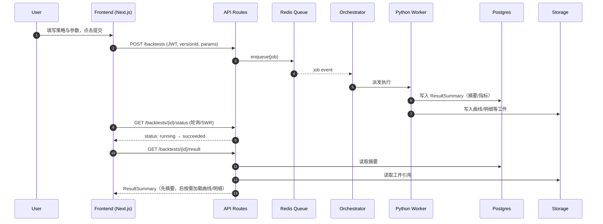
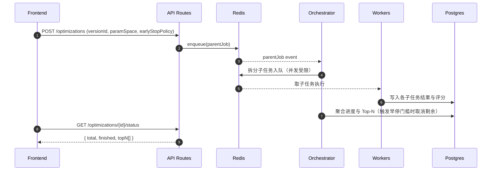

## Components Diagrams

下面给出容器级与组件级关系图，辅助理解模块边界与依赖。

```mermaid
flowchart TB
  subgraph Client
    FE[Frontend App (Next.js)]
  end

  subgraph API[API Layer (Next.js API Routes)]
    APIRoutes[[REST Endpoints]]
    Repo[Data Access (Repositories)]
  end

  subgraph Compute[Compute & Queue]
    Redis[(Redis Queue/Cache)]
    Orchestrator[Orchestrator]
    Workers[Python Workers (Backtest/Opt)]
  end

  subgraph Data[Data & Storage]
    DB[(Supabase Postgres)]
    Store[(Supabase Storage / Object Storage)]
  end

  DS[Tushare API]

  FE -->|Auth/JWT| APIRoutes
  FE -->|REST| APIRoutes
  APIRoutes --> Repo
  APIRoutes --> Redis
  Repo --> DB
  Orchestrator --> Redis
  Redis --> Workers
  Workers --> DS
  Workers --> Store
  Workers --> DB
  FE -->|fetch summary/curve/trades| APIRoutes
````

Rationale

- 前端只与 REST 接口交互；API 层保持薄，复杂度集中在编排与 Worker。
- 结果摘要/大文件分离，通过 Postgres 与对象存储分别管理，满足 NFR2。

```mermaid
flowchart LR
  FE[Frontend Service Layer] -->|submitBacktest| APIRoutes
  APIRoutes -->|enqueue| Redis
  Redis --> Orchestrator
  Orchestrator -->|spawn tasks| Workers
  Workers -->|write summary| DB
  Workers -->|write artifacts| Store
  FE -->|getStatus/getResult| APIRoutes
  APIRoutes --> DB
  APIRoutes --> Store
```

---

## Core Workflows（Sequence）

### 提交流程：Backtest Submit → Status → Result



### 寻优流程：Optimization Submit（含早停/Top‑N 聚合）



Rationale

- 父子作业拆分保证可控并发与聚合能力；Top‑N 与早停加速资源利用。
- 所有错误通过标准错误码/消息上送，便于用户提示与运维监控。
