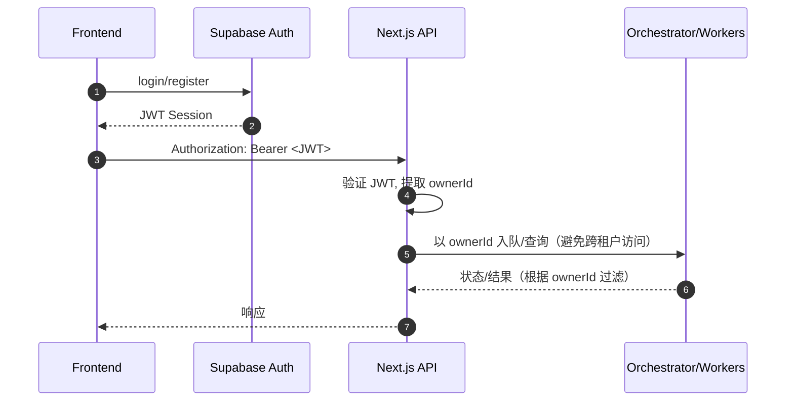

## Backend Architecture

本节定义后端的服务组织、数据库架构与鉴权实现细节。MVP 阶段采用「Next.js API Routes（Serverless/Edge 友好）+ Python FastAPI（传统服务）+ Redis 队列」的混合形态，并为后续演进到 BFF/API Gateway 预留空间。

### Service Architecture

#### Serverless（Next.js API Routes, MVP）

```text
apps/web/src/app/api/               # 轻 API 层（仅粘合/鉴权/校验/编排调用）
  backtests/route.ts                # POST (submit)
  backtests/[id]/status/route.ts    # GET (status)
  backtests/[id]/result/route.ts    # GET (result)
  backtests/[id]/cancel/route.ts    # POST (cancel)
  optimizations/route.ts            # POST (submit parent)
  optimizations/[id]/status/route.ts# GET (parent status)
  health/route.ts                   # GET (canary)
```

职责要点

- 解析 Supabase JWT，推导 `ownerId`。
- 校验请求（对齐 OpenAPI/TS 类型）。
- 通过 Orchestrator/Repo 触达 Redis/Postgres/Storage。
- 统一错误处理，返回 `ApiError`。

#### 传统服务（Python FastAPI：Backtest/Optimization 服务）

```text
services/backtest/
  app/
    main.py               # FastAPI 入口（/internal/backtest, /internal/opt-task）
    orchestrator.py       # 并发/早停/取消/Top-N 聚合（可与队列管理分离）
    workers/
      worker.py           # RQ/Celery 任务与执行入口
    adapters/tushare.py   # 数据源适配与频控/缓存
    result_store.py       # 摘要与工件写入
    models.py             # pydantic schema（与 TS 类型对齐）
```

职责要点

- 承担计算密集逻辑与队列消费；与 Next.js API 层通过 Redis/HTTP 内网交互。
- 保持接口内网可见，避免直接暴露给公网。

### Database Architecture

#### Schema Design（Postgres, 片段）

```sql
-- schemas/001_core.sql
create table if not exists strategies (
  id uuid primary key,
  owner_id uuid not null,
  name text not null,
  tags text[] not null default '{}',
  created_at timestamptz not null default now(),
  updated_at timestamptz not null default now()
);

create table if not exists strategy_versions (
  id uuid primary key,
  strategy_id uuid not null references strategies(id) on delete cascade,
  code text not null, -- 或外部存储引用
  requirements text[] not null default '{}',
  metadata jsonb,
  created_at timestamptz not null default now()
);

create table if not exists backtest_jobs (
  id uuid primary key,
  owner_id uuid not null,
  version_id uuid not null references strategy_versions(id),
  params jsonb not null,
  status text not null check (status in ('queued','running','succeeded','failed','early-stopped','canceled')),
  progress real,
  retries int not null default 0,
  error jsonb,
  result_summary_id uuid,
  created_at timestamptz not null default now(),
  updated_at timestamptz not null default now()
);

create table if not exists optimization_jobs (
  id uuid primary key,
  owner_id uuid not null,
  version_id uuid not null references strategy_versions(id),
  param_space jsonb not null,
  concurrency_limit int not null default 2,
  early_stop_policy jsonb,
  status text not null,
  summary jsonb,
  created_at timestamptz not null default now(),
  updated_at timestamptz not null default now()
);

create table if not exists optimization_tasks (
  id uuid primary key,
  job_id uuid not null references optimization_jobs(id) on delete cascade,
  owner_id uuid not null,
  version_id uuid not null references strategy_versions(id),
  params jsonb not null,
  status text not null,
  progress real,
  retries int not null default 0,
  next_run_at timestamptz,
  throttled boolean not null default false,
  error jsonb,
  last_error jsonb,
  result_summary_id uuid,
  score double precision,
  created_at timestamptz not null default now(),
  updated_at timestamptz not null default now()
);

create table if not exists result_summaries (
  id uuid primary key,
  owner_id uuid not null,
  metrics jsonb not null,
  equity_curve_ref text,
  trades_ref text,
  artifacts jsonb,
  created_at timestamptz not null default now()
);

create index if not exists idx_jobs_owner_created on backtest_jobs(owner_id, created_at desc);
create index if not exists idx_opt_tasks_job on optimization_tasks(job_id);
create index if not exists idx_opt_tasks_status_next on optimization_tasks(status, next_run_at);
```

索引与性能要点

- 作业/任务表按 `owner_id, created_at desc` 建索引，支持历史列表与筛选。
- 结果摘要单表，曲线/明细走外部存储引用，避免巨大行。

#### Data Access Layer（Repository Pattern, TS 示例）

```ts
// apps/web/src/server/repos/backtestRepo.ts
import { createClient } from "@supabase/supabase-js";

export class BacktestRepo {
  constructor(
    private sb = createClient(
      process.env.SUPABASE_URL!,
      process.env.SUPABASE_SERVICE_KEY!
    )
  ) {}

  async getStatus(id: string) {
    const { data, error } = await this.sb
      .from("backtest_jobs")
      .select("id,status,progress,retries,result_summary_id")
      .eq("id", id)
      .single();
    if (error) throw error;
    return data;
  }

  async listByOwner(ownerId: string, limit = 50) {
    const { data, error } = await this.sb
      .from("backtest_jobs")
      .select("id,status,created_at")
      .eq("owner_id", ownerId)
      .order("created_at", { ascending: false })
      .limit(limit);
    if (error) throw error;
    return data;
  }
}
```

### Authentication and Authorization

#### Auth Flow（Supabase Auth + API/Workers）



#### Auth Middleware（API 层示例, TS）

```ts
// apps/web/src/app/api/_lib/auth.ts
import { createServerClient } from "@supabase/ssr";
import { cookies } from "next/headers";

export async function getOwner() {
  const cookieStore = cookies();
  const supabase = createServerClient(
    process.env.NEXT_PUBLIC_SUPABASE_URL!,
    process.env.NEXT_PUBLIC_SUPABASE_ANON_KEY!,
    { cookies: { get: (k) => cookieStore.get(k)?.value } }
  );
  const {
    data: { user },
  } = await supabase.auth.getUser();
  if (!user) throw new Error("UNAUTHENTICATED");
  return { ownerId: user.id };
}
```
