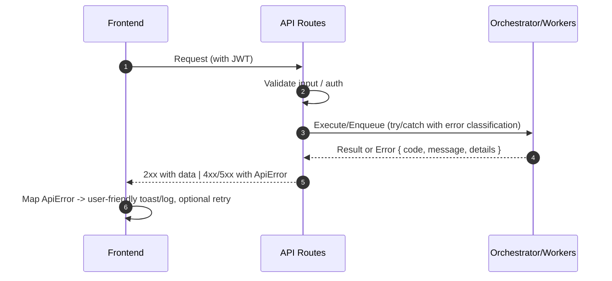

## Error Handling Strategy

### Error Flow



### Error Response Format（TS）

```ts
// packages/shared/types/error.ts
export interface ApiError {
  error: {
    code: string; // e.g., E.PARAM_INVALID, E.AUTH, E.RATE_LIMIT, E.DEP_UPSTREAM
    message: string;
    details?: Record<string, any>;
    timestamp: string;
    requestId: string;
  };
}
```

### Frontend Error Handling（TS）

```ts
// apps/web/src/services/error.ts
import type { ApiError } from "@shared/types/error";

export function toUserMessage(err: unknown): string {
  const api = err as Partial<ApiError>;
  const code = api?.error?.code;
  switch (code) {
    case "E.AUTH":
      return "登录状态已失效，请重新登录。";
    case "E.RATE_LIMIT":
      return "请求过于频繁，请稍后重试。";
    case "E.PARAM_INVALID":
      return "参数校验失败，请检查输入。";
    case "E.DEP_UPSTREAM":
      return "外部依赖暂不可用，请稍后重试。";
    default:
      return api?.error?.message || "发生未知错误，请重试。";
  }
}
```

### Backend Error Handling（TS，API 层）

```ts
// apps/web/src/app/api/_lib/handler.ts
import { NextResponse } from "next/server";

export function ok<T>(data: T) {
  return NextResponse.json(data, { status: 200 });
}

export function fail(
  code: string,
  message: string,
  details?: Record<string, any>,
  status = 400
) {
  return NextResponse.json(
    {
      error: {
        code,
        message,
        details,
        timestamp: new Date().toISOString(),
        requestId: crypto.randomUUID(),
      },
    },
    { status }
  );
}

export function wrap(handler: (req: Request) => Promise<Response>) {
  return async (req: Request) => {
    try {
      return await handler(req);
    } catch (e: any) {
      // 可加入分类：参数/鉴权/上游/内部
      return fail(
        e.code || "E.INTERNAL",
        e.message || "Internal Error",
        { stack: process.env.NODE_ENV === "production" ? undefined : e?.stack },
        500
      );
    }
  };
}
```

### Workers Error Classification（Py，片段）

```py
# services/backtest/app/errors.py
class ParamInvalid(Exception):
    code = "E.PARAM_INVALID"

class UpstreamError(Exception):
    code = "E.DEP_UPSTREAM"

class InternalError(Exception):
    code = "E.INTERNAL"
```

Rationale

- 统一错误结构，便于前端提示、埋点与 SLO 观测。
- 分类错误有助于快速定位（参数/鉴权/上游/内部），并驱动重试与早停策略。
