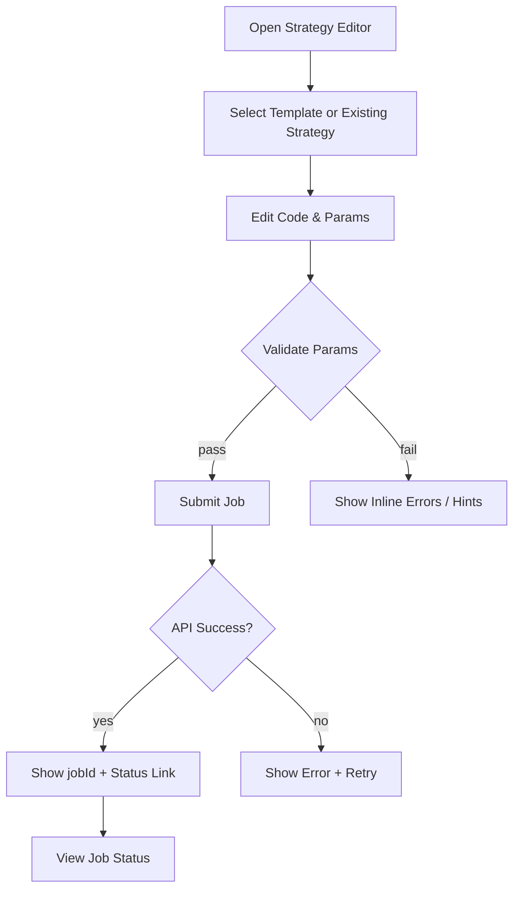
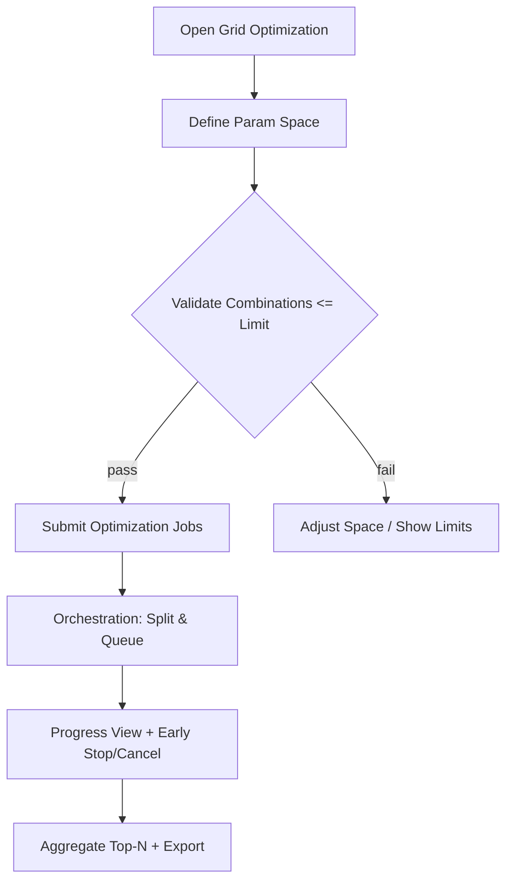

# A股量化策略回测终端（SaaS） UI/UX Specification

> Source docs: `docs/prd.md`, `docs/project-brief.md`, `docs/brainstorming-session-results.md`

---

## Introduction

This document defines the user experience goals, information architecture, user flows, and visual design specifications for A股量化策略回测终端（SaaS）'s user interface. It serves as the foundation for visual design and frontend development, ensuring a cohesive and user-centered experience.

项目背景简述：面向具备一定编程基础的个人量化研究用户，聚焦“编辑 → 回测 → 结果”的最短闭环，支持参数网格寻优、可解释的绩效可视化与最小策略管理/软计费占位。技术栈假设：Next.js + Supabase + Python 回测服务 + Redis 队列。

---

## Overall UX Goals & Principles

### Target User Personas

- Power Researcher（高级研究者）
  - 画像：具备策略开发经验，关注寻优与回测吞吐/稳定；重视批量参数与作业编排。
  - 关键诉求：减少无效等待、可快速定位失败原因、可视化对比不同参数集。
  - 典型场景：提交大参数空间寻优，观察 Top-N 收敛趋势，按阈值早停。

- Practical Analyst（务实分析师）
  - 画像：有一定代码基础，偏业务收益分析；关注指标口径一致性与结果可信度。
  - 关键诉求：清晰的指标定义、稳健的图表交互、可导出与复运行。
  - 典型场景：基于模板小改策略，提交单次回测，查看收益/回撤/夏普与交易明细。

- Newcomer Explorer（新手探索者）
  - 画像：量化初学者或转岗用户，需要默认最佳实践和清晰引导。
  - 关键诉求：策略模板与参数示例、渐进式揭示、错误提示与健康状态可见。
  - 典型场景：使用内置模板，按引导修改少量参数，观察结果并学习。

### Usability Goals

- 易学（Ease of learning）：新手可在 5 分钟内完成“从模板编辑到首次回测提交”的流程。
- 高效（Efficiency）：常用操作（提交、查看状态、查看结果摘要）3 次点击内可达；历史复运行 1 步到位。
- 防错与恢复（Error prevention & recovery）：参数校验明确，失败提供可定位日志与一键重试；破坏性操作需确认。
- 可回忆（Memorability）：界面结构与术语稳定一致，回访用户无需重新学习。
- 可达性（Accessibility）：达成 WCAG AA，深色模式默认；键盘可导航、图表提供可替代文本与对比度。
- 性能感知（Performance perception）：结果页“概要卡”2 秒可见；状态/进度清晰，长任务有骨架屏与渐进加载。

### Design Principles

- 清晰胜于聪明（Clarity over cleverness）：指标名、口径、单位与图例一致，避免隐喻式命名。
- 渐进揭示（Progressive disclosure）：默认显示关键指标与图表，次要信息按需展开。
- 状态驱动（State-driven experience）：以“提交-状态-结果”贯穿作业卡，减少上下文切换。
  - 一致与复用（Consistency & reusability）：统一图表/表格模式与组件状态规范，降低学习成本。
  - 默认可达（Accessible by default）：色彩对比、焦点可见、键盘路径、屏幕阅读器标签为基线要求。

---

## Information Architecture (IA)

### Site Map / Screen Inventory

```mermaid
graph TD
  A[Login/Register] --> B[Dashboard/Jobs]
  B --> C[Strategy Editor + Submit]
  C --> D[Job Status]
  D --> E[Backtest Result]
  B --> F[Grid Optimization]
  B --> G[Jobs & History]
  B --> H[Settings & Quotas]
  B --> I[Health/Status]

  E --> E1[Summary Cards (2s)]
  E --> E2[Equity Curve]
  E --> E3[Trades Table]
  E --> E4[Export/Download]

  C --> C1[Templates Gallery]
  C --> C2[Params Form]
  C --> C3[Dependencies/Requirements]

  F --> F1[Param Space Submit]
  F --> F2[Top-N Aggregation]
  F --> F3[Early Stop/Cancel]
```

### Navigation Structure

- Primary Navigation（顶部主导航）
  - Dashboard/Jobs
  - Strategy Editor
  - Grid Optimization
  - Results（最近一次或从历史进入）
  - Settings
  - Health

- Secondary Navigation（上下文侧边/页内导航）
  - Results 页：Summary / Curve / Trades / Export
  - Editor 页：Templates / Params / Requirements
  - Jobs & History：All / Running / Failed / Succeeded / Optimization

- Breadcrumb Strategy（面包屑）
  - 用于明确 Results 来源上下文：
  - 示例：Dashboard/Jobs > Job #12345 > Result > Trades

设计理由：
- 与 PRD 关键路径对齐（编辑→提交→状态→结果），减少分叉，支撑“最短闭环”。
- 提升可发现性：一级导航承载关键页，二级聚焦页内分区，避免顶层过载。
- 性能与可达性：Results 的 Summary 区 2 秒可见，配合渐进加载，契合 NFR。
- 寻优合流：Grid Optimization 作为一级入口，历史统一归档在 Jobs & History，复运行路径一致。
- 面包屑稳定用户心智，适配从不同入口进入结果页的定位问题。

---

## User Flows

本节覆盖四条关键用户任务流：提交回测、查看回测结果、参数网格寻优、历史复运行。每条包含目标、入口、成功标准、Mermaid 流程图、边界与处理策略以及补充备注。

### Flow A: Submit Backtest（提交回测）

- 用户目标（User Goal）
  - 从模板或现有策略出发，编辑参数后成功提交回测作业，获取 jobId 与可见状态。
- 入口（Entry Points）
  - Dashboard/Jobs 卡片按钮；Strategy Editor 顶栏“Submit”；模板库进入编辑器。
- 成功标准（Success Criteria）
  - 参数校验通过并提交成功；用户看到 jobId 与状态 queued/running；错误可定位可重试。



- 边界与错误处理（Edge Cases & Error Handling）
  - 参数类型/范围不合法 → 表单内联错误、字段定位与示例值提示。
  - 依赖/requirements 缺失 → 阻断提交并提供“去管理依赖”快捷入口。
  - API 超时/失败 → 退避重试提示，支持“复制 payload 重试”。
- 备注（Notes）
  - 区分“保存草稿”与“提交”以避免误操作；提供“示例参数一键填充”。

### Flow B: View Backtest Result（查看回测结果）

- 用户目标（User Goal）
  - 在 2 秒内看到概要卡；随后查看净值曲线与交易明细，确认指标与导出。
- 入口（Entry Points）
  - 提交成功后的状态页“View Result”，或从 Jobs & History 进入。
- 成功标准（Success Criteria）
  - 概要卡 2 秒内可见；曲线与表格渐进加载；导出可用。

```mermaid
graph TD
  A[Open Result Page] --> B[Load Summary Cards (cached)]
  B --> C[Load Equity Curve (async)]
  C --> D[Load Trades Table (virtualized)]
  B --> E{Need Export?}
  E -- yes --> F[Generate/Download File]
  E -- no --> G[Continue Analysis]
```

- 边界与错误处理（Edge Cases & Error Handling）
  - 数据部分缺失 → 占位与提示说明口径/抽样。
  - 大数据导致卡顿 → 虚拟滚动、分页与“仅显示最近 N 条”开关。
  - 基准/口径选择变化 → 增量刷新，不阻塞概要卡。
- 备注（Notes）
  - 与 NFR 对齐：概要卡缓存与预聚合，保障 2 秒可达；图表深色模式、键盘可达、替代文本。

### Flow C: Grid Optimization（参数网格寻优）

- 用户目标（User Goal）
  - 提交参数空间并发寻优，查看进度与 Top-N，支持早停/取消与汇总导出。
- 入口（Entry Points）
  - 顶部导航“Grid Optimization”，或从 Editor 的“Run Optimization”。
- 成功标准（Success Criteria）
  - 拆分子作业成功、进度可视化、Top-N 实时汇总、阈值触发早停。



- 边界与错误处理（Edge Cases & Error Handling）
  - 组合数量爆炸 → 上限校验与估算提示；提供采样/分批策略。
  - 子作业失败 → 分类展示失败原因；支持重试与剔除异常点。
  - 早停阈值设置不当 → 预置推荐阈值与解释提示。
- 备注（Notes）
  - 与 Epic 2 对齐：进度可视化与 Top-N 汇总是核心可见价值；历史复运行体验与普通作业一致。

### Flow D: Re-run From History（历史复运行）

- 用户目标（User Goal）
  - 在历史列表中一键复运行某作业或采用其参数作为新提交的基线。
- 入口（Entry Points）
  - Jobs & History 列表项操作按钮。
- 成功标准（Success Criteria）
  - 一步复运行或“带入参数打开编辑器”，并清晰标注版本/依赖变更。

---

## Wireframes & Mockups

本节明确设计文件位置与关键页面的低保真（Low-fi）布局，围绕“编辑→提交→状态→结果”的主路径与寻优入口。

### Primary Design Files

- 设计工具：Figma（建议按模块建 Page：Editor、Results、Optimization、History、Settings、Health）
- 占位链接：<https://www.figma.com/file/your-file-id/stockstock-mvp>
- 命名约定：Frame 使用 kebab-case，如 `editor-submit`, `result-summary`, `result-curve`

### Key Screen Layouts

#### Strategy Editor + Submit

- Purpose：将代码编辑、参数表单与提交流同屏整合，降低上下文切换与误操作。
- Key Elements：
  - 左：代码编辑器（深色模式、语法高亮、错误行标注）
  - 中：参数表单（分组/折叠、校验提示、示例一键填充）
  - 右：作业卡（Submit、Draft、依赖/requirements、最近作业概览/跳转）
- Interaction Notes：
  - Submit 成功后右侧作业卡即时显示 jobId/状态；失败提供“复制 payload 重试”
  - 顶栏提供 Templates、Params、Requirements 的页内标签
- Design File Reference：`editor-submit`

#### Job Status

- Purpose：提供统一的“提交-排队-运行-成功/失败/早停”的状态可视化与操作位。
- Key Elements：状态时间线（queued/running/succeeded/failed/early-stopped）、进度与估时、取消/早停、最近日志片段
- Interaction Notes：失败提供分类原因与“重试/查看日志”快捷
- Design File Reference：`job-status`

#### Backtest Result

- Purpose：2 秒内呈现概要卡，随后逐步加载曲线与明细，支持导出。
- Key Elements：概要卡（收益/回撤/夏普等）、净值曲线（区间/缩放/tooltip/可选基准）、交易明细表（虚拟滚动、筛选/排序、导出）
- Interaction Notes：骨架屏/占位；增量刷新不阻塞概要卡；深色模式与可达性基线
- Design File Reference：`result-summary`, `result-curve`, `result-trades`

#### Grid Optimization

- Purpose：提交参数空间并发寻优，查看进度与 Top-N，支持早停/取消与汇总导出
- Key Elements：参数空间定义（组合估算与上限校验）、进度面板（整体与子作业）、早停/取消、Top-N 榜单卡、导出
- Interaction Notes：组合超限提示采样/分批；失败子作业可单独重试或剔除
- Design File Reference：`optimization-main`

#### Jobs & History

- Purpose：汇总查看与筛选所有作业，一键复运行
- Key Elements：列表/表格（状态筛选与搜索）、复运行按钮、结果直达
- Interaction Notes：“带入参数到编辑器”与“直接复运行”分离，避免误点
- Design File Reference：`jobs-history`

---

## Component Library / Design System

### Design System Approach
- 短期：采用成熟 UI 库作基座（定稿：Radix UI + Tailwind + shadcn/ui），快速达成表单、表格与可达性基线。
- 中期：沉淀自定义组件层（图表卡、指标卡、作业卡、Top-N 榜单卡），统一交互与视觉语言。
- 图表：ECharts（定稿），抽象统一 `ChartPanel` 容器与主题，支持深色模式与可达性设置。
- 取舍：成熟库降低 MVP 成本并提升一致性；自定义层承载“状态驱动”的核心体验，避免业务逻辑散落页面层。
 
### Core Components（首批核心组件与状态）
 
- MetricCard（指标卡）
  - Purpose：展示收益、回撤、夏普等关键指标，支持加载/缺省/错误状态。
  - Variants：compact/regular；单指标/多指标组。
  - States：loading/ready/partial/error。
  - Usage：结果页首屏优先；与数据口径说明联动。
 
- JobCard（作业卡）
  - Purpose：串联提交-状态-结果；含 jobId、状态、重试/取消等动作。
  - Variants：minimal（列表）、detailed（右侧栏）。
  - States：queued/running/succeeded/failed/early-stopped/canceled。
  - Usage：编辑器右栏、Dashboard 卡片、历史列表。
 
- ChartPanel（图表容器）
  - Purpose：封装 ECharts 图表与统一交互（缩放、tooltip、导出、主题）。
  - Variants：line/area/bar；withBaseline/noBaseline。
  - States：loading/ready/empty/error；dark/light。
  - Usage：净值曲线、优化进度、Top-N 表现对比。
 
- TradesTable（交易表）
  - Purpose：大数据量交易明细的高性能表格。
  - Variants：virtualized/paginated；compact/dense。
  - States：loading/ready/empty/error。
  - Usage：结果页，支持导出、筛选、排序、列配置。
 
- ParamsForm（参数表单）
  - Purpose：参数编辑与校验，支持示例一键填充。
  - Variants：grouped/collapsible；simple/advanced。
  - States：pristine/invalid/valid/submitting.
  - Usage：编辑器中部；与 requirements 编辑入口联动。
 
- TopNList（寻优 Top-N 榜单）
  - Purpose：实时展示最优组合与指标快照。
  - Variants：table/cards；withTrend.
  - States：loading/ready/empty/error.
  - Usage：优化页与结果汇总。
 
### 规范建议（跨组件一致性）
- 状态语义与占位：统一支持 loading/empty/error/partial；约定骨架屏样式与错误信息格式。
- 尺寸与栅格：基线 8px spacing；3 密度档（compact/regular/comfortable）；12 列栅格。
- 主题与深色模式：Token 化颜色与阴影；深浅主题切换无闪烁；图表与表格遵循同一主题。
- 可达性：焦点可见；键盘可操作路径；ARIA 标签；图表替代文本与高对比度方案。
 
 设计理由：
 - 与 PRD/NFR 对齐：强调首屏 MetricCard 与高性能表格；统一 ChartPanel 降低实现与主题切换成本。
 - 可维护性：组件抽象围绕“作业驱动体验”，减少页面层重复；一致的状态与占位降低边界缺陷。
 - 渐进增强：先用成熟库达标，再沉淀自定义层，适配 MVP→扩展。

---

## Branding & Style Guide

### Visual Identity
 - Brand Guidelines（占位）：若已有企业品牌手册，请提供链接；否则采用“金融科技专业风格 + 高对比度中性色 + 深色模式优先”的基调，深色模式优先。
 - 建议在 Figma 建立 Tokens 页面（颜色/字体/半径/阴影/间距），实现设计-前端的统一来源。

### Color Palette
 - 目标对比度：AA 为基线，实际以实现时的可达性测试为准。
 - Palette（深色模式优先）：
   - Primary: `#1E90FF`（主动作/链接）
   - Secondary: `#7C8A99`（次级元素/标签）
   - Accent: `#FFB020`（强调/图表高亮）
   - Success: `#16A34A`
   - Warning: `#F59E0B`
   - Error: `#DC2626`
   - Neutrals：
     - Background: `#0B0F14`
     - Surface: `#121821`
     - Border: `#223041`
     - Text Primary: `#E6EDF3`
     - Text Secondary: `#A9B5C1`
 - 图表配色（ECharts 建议）：
   - Line1: `#1E90FF`, Line2: `#34D399`, Line3: `#F59E0B`, Line4: `#A78BFA`
   - 坐标轴/网格线：深/浅模式下的对比度自适配，确保可读性。

### Typography
 - Font Families：
   - Primary: Inter（通用 UI 文本）
   - Secondary: Source Sans 3（可选，标题层次）
   - Monospace: JetBrains Mono（代码/参数/日志）
 - Type Scale（首版建议）：
   - H1: 32/40, 700
   - H2: 24/32, 600
   - H3: 20/28, 600
   - Body: 14/22, 400
   - Small: 12/18, 400
 - 深色模式可微调字重与字间距以提升可读性。

### Iconography
 - Icon Library：Lucide/Feather（线性图标）
 - Usage Guidelines：统一线宽 1.5px；深色背景保持高对比描边；图标不替代文字标签。

### Spacing & Layout
 - Grid System：12 列；桌面列间距 24px；移动端 4/6 列变体。
 - Spacing Scale：4/8/12/16/20/24/32/40/48。
 - Radius：6/8；深色模式弱化阴影，使用分隔/描边增强层次。
 - Motion：150–200ms 为默认交互；图表交互不超过 250ms；`ease-out`/`ease-in-out`。

 设计理由与取舍：
 - 与 PRD 的“高对比度中性色 + 深色模式优先”一致，并满足 WCAG AA。
 - Inter + JetBrains Mono 兼顾通用 UI 与代码/参数场景的可读性与一致性。
 - 通过 Token 化管理降低跨端同步成本，确保主题与组件层一致演进。

---

## Accessibility Requirements

### Compliance Target
 - Standard：WCAG 2.2 AA（深色模式优先；桌面为主，移动端保证基本可访问）

### Key Requirements
 - Visual
   - Color contrast：交互文本与正文 ≥ 4.5:1；大标题 ≥ 3:1；图表线条与背景 ≥ 3:1
   - Focus indicators：可见焦点环（≥2px，非仅颜色变化），与品牌主色区分度清晰
   - Text sizing：支持系统字体缩放至 200%；在 125% 缩放下布局不破版

 - Interaction
   - Keyboard navigation：全站可 Tab；提供“Skip to content”；焦点顺序与视觉一致
   - Screen reader：关键区域/组件具备 ARIA 角色与标签；状态变更使用 `aria-live`
   - Touch targets：最小 40x40px；触摸与鼠标 hover 有对等反馈

 - Content
   - Alternative text：装饰图标 `aria-hidden`；功能图标提供 `aria-label`
   - Heading structure：H1-H3 层级清晰；语义化结构（`header/nav/main/section/footer`）
   - Form labels：每个输入具备可见与编程可读的 label；错误消息与控件关联并可朗读

### Testing Strategy
 - 工具链
   - 自动化：`eslint-plugin-jsx-a11y`、`axe-core`（开发与 CI）、Storybook a11y 插件
   - 手动/半自动：键盘走查（无鼠标）、屏幕阅读器抽检（VoiceOver/NVDA）、对比度检查
 - 回归重点
   - 深色模式切换
   - 结果页图表（提供摘要与替代文本）
   - 表格虚拟滚动（列标题/排序状态朗读、分页/虚拟滚动可达）
   - 作业卡状态变更（`aria-live=polite`）
 - 基线用例
   - 仅键盘完成“提交回测”全流程
   - 结果页概要卡 2 秒内可见且被 SR 感知与播报
   - 图表提供“本段摘要”（如“净值+3.2%、最大回撤4.8%”）

 设计理由：与 PRD NFR 的“2 秒首屏可见、深色模式优先”一致，通过对比度/焦点/ARIA 的硬约束与工具链落地，保证 MVP 即可达标且可回归。

---

## Responsiveness Strategy

### Breakpoints
 - Mobile：360–767px（常见 375/390）
 - Tablet：768–1023px（常见 768/834）
 - Desktop：1024–1439px（常见 1280/1366）
 - Wide：≥1440px（常见 1440/1600/1920）

### Adaptation Patterns
 - Layout Changes
   - 编辑器页：三栏（代码/参数/作业卡）→ Tablet 合并为两栏（代码+参数 / 作业卡抽屉）→ Mobile 单列（作业卡底部抽屉）
   - 结果页：Summary 固定首屏；Curve 与 Trades 纵向堆叠；Wide 下 Summary/Curve 复合布局（2:3 栅格）
 - Navigation Changes
   - 顶部导航在 Tablet/Mobile 折叠为 Drawer；Results 页内二级导航改为横向 Tabs + Anchor
   - 面包屑在移动端仅保留“返回上一层”与当前节点，减少占位
 - Content Priority
   - 移动端优先保留“概要卡 → 关键按钮（导出/复运行） → 曲线 → 明细”
   - 表格在移动端默认显示关键列（时间、方向、价格、盈亏），提供“展开更多”
 - Interaction Changes
   - 悬停交互在触屏设备给出等效点击/长按方案
   - 图表缩放与 tooltip 在触屏启用手势与固定信息卡模式

 设计理由：对齐 PRD 的“2 秒内可见概要卡”和“多设备可浏览”。桌面保留专家信息密度，移动端以抽屉与分节降低实现与维护成本。

---

## Animation & Micro-interactions

### Motion Principles
 - 简洁克制：动效服务信息，不喧宾夺主；默认 150–200ms，进入 200ms，退出 150ms。
 - 可回馈可预期：每个动作具备明确反馈；与组件状态一致（loading/ready/error）。
 - 性能优先：避免重排/重绘热点；使用合成层（transform/opacity），目标 60fps。
 - 可达性与可控：尊重系统 `prefers-reduced-motion`；提供动效强度/时长的降级选项。
 - 语义一致：同类操作使用同类曲线与时长（如所有抽屉 200ms ease-out）。

### Key Animations
 - 提交回测（Submit）
   - 按钮微缩放 + 右侧作业卡淡入显示状态条（180ms，ease-out）；`aria-live` 提示 jobId。
 - 作业状态更新（Status Tick）
   - 时间线节点由灰到主色渐变 + 轻微缩放（160ms，ease-in-out）；`aria-live=polite`。
 - 概要卡加载（Summary Ready）
   - 骨架到内容交叉淡入；数字轻微滚动 <400ms；仅用 transform/opacity。
 - 图表交互（Hover/Zoom）
   - tooltip 渐入、轴线强调；触屏用手势与固定信息卡模式。
 - 表格虚拟滚动（Row Enter）
   - 行淡入/位移 <120ms；大批量渲染场景禁用。
 - 抽屉/侧栏（Drawer）
   - x 轴位移 + 阴影渐入（200ms，ease-out）；焦点陷阱与 ESC 关闭，进出时焦点管理。

### 性能与降级策略
 - 优先 CSS（transform/opacity），减少 JS 驱动动画；后台标签/低性能设备禁用昂贵动效。
 - 为图表/表格等高频区域提供“低动效模式”。
 - `prefers-reduced-motion` 时降低或禁用非必要动效。

### 统一曲线与时长（Tokens）
 - Durations：xfast 120ms，fast 160ms，base 200ms，slow 250ms
 - Easings：
   - ease-out：`cubic-bezier(0.2, 0, 0, 1)`
   - ease-in-out：`cubic-bezier(0.4, 0, 0.2, 1)`
   - rebound（慎用，仅提示性）：`cubic-bezier(0.2, 0.8, 0.2, 1)`

 设计理由：与 PRD NFR（首屏 2s、性能/可达性）对齐；动效轻量化、可降级、可控，统一 Token 便于工程落地与一致体验。

---

## Performance Considerations

### Performance Goals
 - Page Load
   - 结果页概要卡首屏可见 ≤ 2s（含缓存/预聚合）
   - 首屏 JS 可执行体量 ≤ 200KB gzip（MVP 阶段目标）
 - Interaction Response
   - 关键交互（提交按钮反馈、状态切换、Tab 切换）≤ 100ms 反馈
 - Animation FPS
   - 动效 60fps 目标；图表交互（缩放/tooltip）≥ 45fps

### Design Strategies
 - 首屏与分步加载
   - 结果页：Summary 优先；Curve/Trades 延迟或并行流式；骨架屏覆盖所有数据模块
   - 路由级分包与组件懒加载；按需加载图表库与重型表格模块
 - 数据与缓存
   - “摘要优先”接口（摘要聚合+缓存），避免请求级联阻塞首屏
   - 图表数据支持抽样/分片；大表格虚拟滚动与分页
 - 图表与表格性能
   - 在 `ChartPanel` 控制采样、数据量阈值与渲染降级（线→面积→抽样）
   - `TradesTable` 默认虚拟滚动；超阈值启用列虚拟化与服务端分页
 - 渲染与动效
   - 优先使用 transform/opacity；禁用触发重排的属性动画
   - `prefers-reduced-motion` 时关闭非必要动效
 - 观测与回归
   - 埋点 Web Vitals（TTFB、FCP、LCP、INP）；记录“摘要从请求到可见”自定义指标
   - 交互采样与慢查询日志，形成性能回归基线

 设计理由：与 PRD NFR 对齐（2 秒首屏、可观测性、性能稳定）。“摘要优先 + 分步加载 + 组件级降级”的组合保障体验与可维护性。

---

## Next Steps & Checklist Results

### Immediate Actions
 - 确认图表库与 UI 基座：定稿 ECharts 与 Radix UI + Tailwind + shadcn/ui
 - 建立设计 Tokens：Figma 与前端（CSS Vars/Theme 对象）同步颜色/字体/间距/动效 Token
 - 打样关键组件：`MetricCard`、`ChartPanel`、`TradesTable`、`JobCard` 从 Low-fi 到可交互
 - 结果页首屏优化打样：实现“概要卡 ≤2s 可见 + Curve/Trades 渐进加载”
 - 可达性基线落地：启用 `eslint-plugin-jsx-a11y`、`axe-core`，编写 3 条基线用例
 - 性能埋点：埋设 Web Vitals 与“摘要可见”自定义指标

### Design Handoff Checklist
 - All user flows documented（`## User Flows`）
 - Component inventory complete（`## Component Library / Design System`）
 - Accessibility requirements defined（`## Accessibility Requirements`）
 - Responsive strategy clear（`## Responsiveness Strategy`）
 - Brand guidelines incorporated（`## Branding & Style Guide`）
 - Performance goals established（`## Performance Considerations`）

### Open Questions
 - 队列框架：RQ vs Celery（与前端状态模型字段/错误码映射）
 - 结果模型口径：复权/时区/基准的统一定义与展示策略
 - 移动端覆盖深度：是否提供提交/复运行等关键操作
 - 品牌与字体：是否沿用企业规范或采用当前建议（Inter + JetBrains Mono）

### Checklist Results（自检）
 - PRD 对齐度：高（主路径与 NFR 已反映在 IA、Flows、Performance、A11y）
 - 风险与缓解：性能/可达性章节提供降级与测试策略
 - 可落地性：Token 与组件抽象清晰，便于并行推进

---

## Change Log

| Date | Version | Description | Author |
| --- | --- | --- | --- |
| 2025-09-10 | v0.1 | 初始化文档（创建 Introduction 与占位章节） | Sally（UX Expert） |
| 2025-09-10 | v0.2 | 填充 UX 目标、画像与设计原则，进入 IA 章节 | Sally（UX Expert） |
| 2025-09-10 | v0.3 | 写入 Information Architecture（站点图与导航结构） | Sally（UX Expert） |
| 2025-09-10 | v0.4 | 写入 User Flows（四条关键流程与处理策略） | Sally（UX Expert） |
| 2025-09-10 | v0.5 | 写入 Wireframes & Mockups（设计文件与 5 个关键页面 Low-fi 布局） | Sally（UX Expert） |
| 2025-09-10 | v0.6 | 写入 Component Library / Design System（选型与核心组件） | Sally（UX Expert） |
| 2025-09-10 | v0.7 | 写入 Branding & Style Guide（配色/字体/图标/布局/动效） | Sally（UX Expert） |
| 2025-09-10 | v0.8 | 写入 Accessibility Requirements（合规目标/关键要求/测试策略） | Sally（UX Expert） |
| 2025-09-10 | v0.9 | 写入 Responsiveness Strategy（断点与适配模式） | Sally（UX Expert） |
| 2025-09-10 | v0.10 | 写入 Animation & Micro-interactions（原则/清单/降级/Token） | Sally（UX Expert） |
| 2025-09-10 | v0.11 | 写入 Performance Considerations（目标与策略） | Sally（UX Expert） |
| 2025-09-10 | v0.12 | 写入 Next Steps & Checklist Results（行动项与交接清单） | Sally（UX Expert） |
